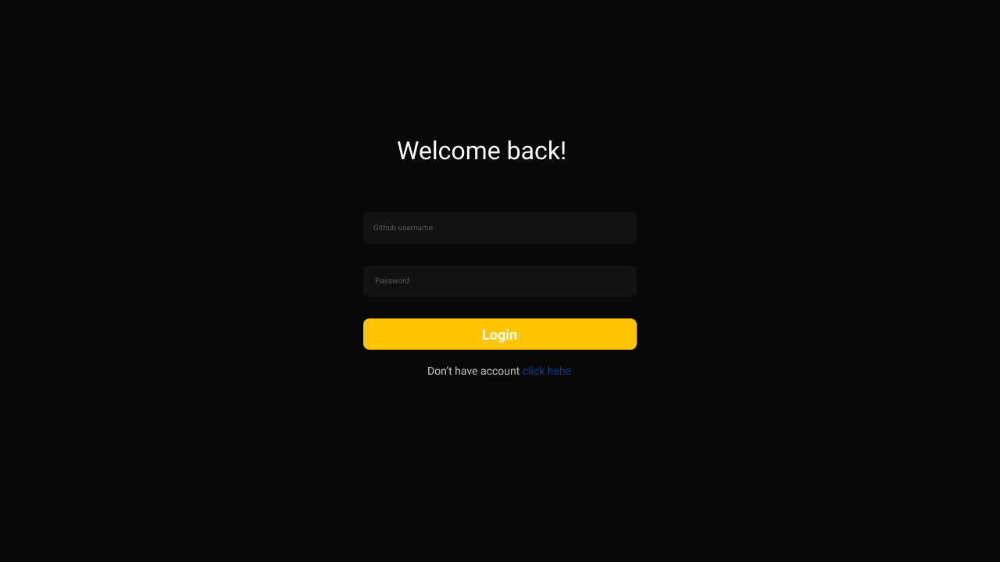
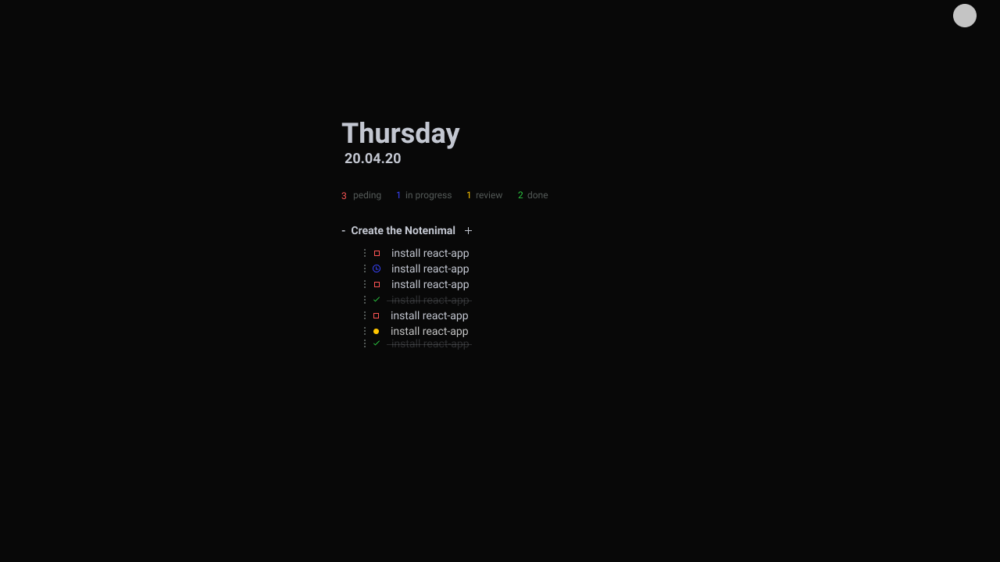

<h1 align="center" style="display: flex;flex-direction: column;">
 
  

    
  
  

 
 
</h1>

<h1 align="center"">
TASK MINIMAL
 
</h1>

<!-- 
A little description about your project
 -->

  

## Features

[//]: # 'Add the features of your project here:'

This app features all the latest tools and practices in mobile development!

- ⚛️ **React Js** — A JavaScript library for building user interfaces

## Getting started

In building...

<!-- Describe here the way to use/install your project -->

## License

This project is licensed under the MIT License - see the [LICENSE](https://opensource.org/licenses/MIT) page for details.
